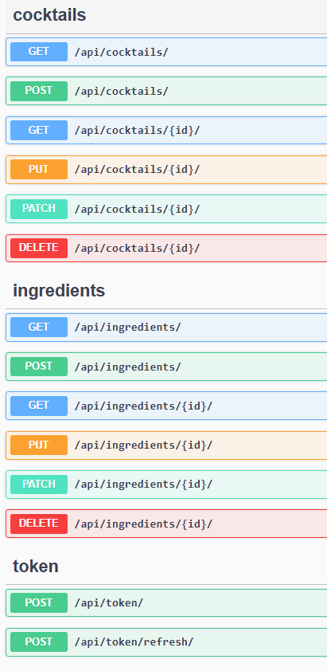
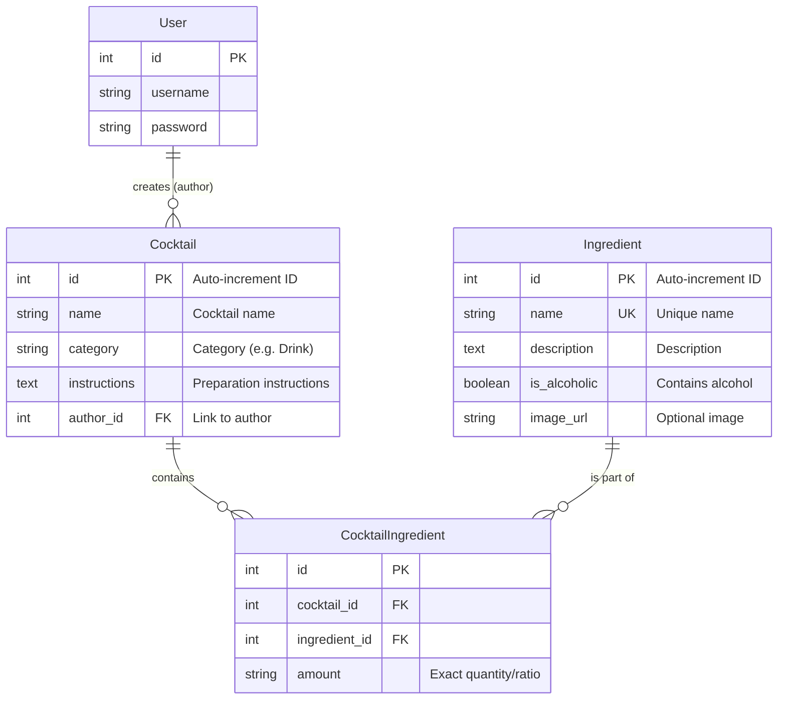

# 🍹 Koktajlownik API

<div align="center">

**Your ultimate cocktail recipe management API — built with Django**

[](https://www.python.org/)
[](https://www.djangoproject.com/)
[](https://www.django-rest-framework.org/)
[](https://www.postgresql.org/)
[](https://jwt.io/)
[](https://swagger.io/)
[](LICENSE)

</div>

---

## About the Project

**Koktajlownik** is a fully functional, secure REST API for managing cocktail recipes and an ingredient database. Built on top of Django REST Framework and PostgreSQL, it serves as a solid backend foundation for modern frontend and mobile applications.

### ✨ Key Features

| | Feature | Description |
|---|---|---|
| 🍸 | **Cocktail Management** | Full CRUD for recipes — ingredients handled in a single request |
| 🧂 | **Ingredient Database** | Manage ingredients split into alcoholic and non-alcoholic |
| 🔐 | **JWT Authorization** | Only the author or an Admin can edit/delete a cocktail |
| 🔍 | **Filtering & Pagination** | Search by category and name; built-in result pagination |
| ✅ | **Data Validation** | Strict validation — DRF built-ins + custom validators |

---

## 🚀 Quick Start

```bash
# 1. Install dependencies
pip install -r requirements.txt

# 2. Run migrations and create a superuser
python manage.py makemigrations
python manage.py migrate
python manage.py createsuperuser

# 3. Start the server
python manage.py runserver
```

> 📖 Interactive Swagger docs (OpenAPI 3.0) available at: **http://127.0.0.1:8000/api/docs/**



---

## ⚙️ Environment Variables

Create a `.env` file in the project root:

```env
SECRET_KEY=your-unique-django-secret-key
DEBUG=True

DB_NAME=koktajlownik
DB_USER=postgres
DB_PASSWORD=your-password
```

---

## 🗄️ Database Schema



---

## 📡 API Endpoints

### 🍹 Cocktails — `/api/cocktails/`

| Method | Endpoint | Description | Auth |
|--------|----------|-------------|:----:|
| `GET` | `/api/cocktails/` | List cocktails *(pagination & filters)* | — |
| `GET` | `/api/cocktails/:id` | Cocktail details | — |
| `POST` | `/api/cocktails/` | Create a new cocktail | 🔐 |
| `PATCH` | `/api/cocktails/:id` | Update a cocktail *(author/admin only)* | 🔐 |
| `DELETE` | `/api/cocktails/:id` | Delete a cocktail *(author/admin only)* | 🔐 |

**Query params:** `?search=` · `?category=` · `?ordering=`

### 🧂 Ingredients — `/api/ingredients/`

| Method | Endpoint | Description | Auth |
|--------|----------|-------------|:----:|
| `GET` | `/api/ingredients/` | List ingredients | — |
| `GET` | `/api/ingredients/:id` | Ingredient details | — |
| `POST` | `/api/ingredients/` | Add an ingredient | 🔐 |
| `PATCH` | `/api/ingredients/:id` | Update an ingredient | 🔐 |
| `DELETE` | `/api/ingredients/:id` | Delete an ingredient | 🔐 |

### 🔑 Authorization

| Method | Endpoint | Description |
|--------|----------|-------------|
| `POST` | `/api/token/` | Obtain Access + Refresh Token |
| `POST` | `/api/token/refresh/` | Refresh an expired Access Token |
